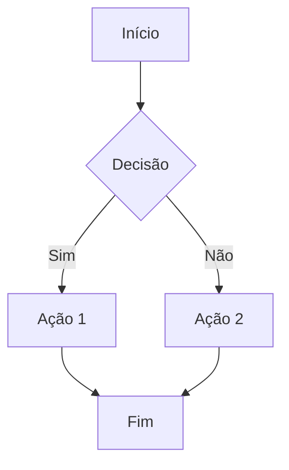

# Editor Markdown

Um editor markdown completo e moderno com recursos avançados, desenvolvido com HTML5, CSS3 e JavaScript vanilla.

## Link para acesso

https://workspace-mac.vercel.app

## ✨ Funcionalidades

### 📝 Editor Principal
- **Interface dual-pane** com editor à esquerda e preview à direita
- **Sintaxe highlighting** para markdown com cores personalizadas
- **Numeração de linhas** opcional
- **Contador de palavras e caracteres** em tempo real
- **Indentação automática** e suporte a tecla Tab
- **Auto-save** a cada 30 segundos
- **Sistema de abas** para múltiplos documentos

### 🔧 Formatação
- **Barra de ferramentas flutuante** com atalhos de formatação
- **Atalhos de teclado** completos (Ctrl+B, Ctrl+I, etc.)
- **Títulos** (H1-H6) com navegação por níveis
- **Listas** ordenadas, não-ordenadas e de definição
- **Links e imagens** com diálogos intuitivos
- **Tabelas** com geração automática
- **Citações** estilizadas
- **Código inline e blocos** de código
- **LaTeX** inline e em bloco para fórmulas matemáticas
  - LaTeX inline: `$fórmula$` ou `\(fórmula\)`
  - LaTeX em bloco: `$$fórmula$$` ou `\[fórmula\]`
- **Diagramas Mermaid** integrados
- **Blocos de destaque** e callouts
- **Alinhamento de texto** (esquerda, centro, direita, justificado)
- **Colunas** para layout avançado

### 🎨 Temas e Aparência
- **Temas**: Escuro (padrão), Claro, Personalizado
- **Tipografia Completa**: Configuração individual para cada elemento
  - Fonte base (parágrafos) e editor
  - Tamanhos individuais: H1, H2, H3, H4, H5, H6, Blockquote
- **Cores Personalizadas**: 
  - Texto: Cores individuais para cada elemento (p, H1-H6, blockquote)
  - Fundo: Cores de fundo personalizadas para página, editor, títulos, blockquotes
- **Elementos de Bloco**: 
  - Blocos de código (cor do texto e fundo)
  - Blocos LaTeX (cor do texto e fundo)
  - Barra lateral dos elementos em bloco
  - Linha horizontal (HR)
- **Elementos Inline**:
  - Código inline (cor do texto e fundo)
  - LaTeX inline (cor do texto)
  - Destaque/marcação (cor do texto e fundo)
- **Tabelas Personalizadas**:
  - Cabeçalho (cor do texto e fundo)
  - Corpo da tabela (cores normais e padrão zebra)
  - Cor da borda
- **Responsivo** para desktop, tablet e mobile

### 🔄 Preview e Renderização
- **Preview em tempo real** com renderização instantânea
- **Syntax highlighting** para código com Highlight.js
- **Renderização de LaTeX** com KaTeX
- **Diagramas Mermaid** com renderização visual
- **Tabelas responsivas** com hover effects
- **Links externos** abrem em nova aba
- **Navegação por títulos** com scroll suave

### 📁 Gestão de Documentos
- **Sistema de abas** com gerenciamento completo
- **Salvamento automático** no localStorage
- **Histórico de sessão** (restaura abas ao reabrir)
- **Multi-tab sync** (sincronização entre abas)
- **Busca e substituição** avançada
- **Duplicação** de documentos
- **Renomeação** de documentos

### ☁️ Integração Knowledge Hub
- **Botão "Salvar no Hub"** com modal dedicado
- **Metadados automáticos** (título, data, contagem de palavras)
- **Geração de tags** baseada no conteúdo
- **Pré-visualização** de como ficará no Hub
- **Suporte a descrições** e metadados customizados

### ⚙️ Configurações Avançadas
- **Painel de configurações** organizado por abas
- **Configurações de tema** (Escuro, Claro, Personalizado)
- **Personalização de tipografia** (tamaños de fonte)
- **Cores personalizáveis** para todos os elementos
- **Configurações do editor** (numeração de linhas, auto-save)
- **Restaurar padrões** a qualquer momento

### ⌨️ Atalhos de Teclado

#### Arquivo
- `Ctrl+S` - Salvar documento
- `Ctrl+Shift+S` - Salvar como
- `Ctrl+N` - Novo documento
- `Ctrl+O` - Abrir documento
- `Ctrl+W` - Fechar aba
- `Ctrl+T` - Nova aba

#### Formatação
- `Ctrl+B` - **Negrito**
- `Ctrl+I` - *Itálico*
- `Ctrl+U` - <u>Sublinhado</u>
- `Ctrl+`` - `Código inline`
- `Ctrl+Shift+`` - Bloco de código

#### LaTeX
- `Ctrl+M` - LaTeX inline: \\(x^2\\)
- `Ctrl+Shift+M` - Bloco de LaTeX: $$\\int x^2 dx$$

#### Títulos
- `Ctrl+1` a `Ctrl+6` - Títulos H1 a H6

#### Listas
- `Ctrl+Shift+U` - Lista não ordenada
- `Ctrl+Shift+O` - Lista ordenada

#### Navegação
- `Ctrl+[` - Aba anterior
- `Ctrl+]` - Próxima aba
- `Ctrl+Shift+E` - Focar no editor
- `Ctrl+Shift+P` - Focar no preview

#### Editor
- `Ctrl+D` - Duplicar linha
- `Alt+↑/↓` - Mover linha para cima/baixo
- `Ctrl+/` - Comentar/descomentar
- `Tab` - Indentar
- `Shift+Tab` - Desindentar

#### Outros
- `F1` - Ajuda
- `F11` - Tela cheia
- `Ctrl+,` - Configurações
- `Ctrl+Shift+S` - Salvar no Hub

### 🔧 Recursos Técnicos

#### APIs e Bibliotecas
- **Marked** - Parser markdown
- **Highlight.js** - Syntax highlighting
- **KaTeX** - Renderização LaTeX
- **Mermaid** - Diagramas
- **Font Awesome** - Ícones
- **Google Fonts** - Tipografia (Inter, JetBrains Mono)

#### Características
- **JavaScript vanilla** - Sem dependências de framework
- **LocalStorage** - Persistência de dados
- **Responsive design** - Adapta-se a qualquer tela
- **Modular architecture** - Código organizado em módulos
- **Event-driven** - Sistema de eventos para comunicação
- **Error handling** - Tratamento robusto de erros
- **Performance optimized** - Debounce e throttle para otimização

## 📦 Estrutura do Projeto

```
editor-markdown/
├── index.html              # Página principal
├── styles/
│   ├── main.css           # Estilos principais
│   ├── themes.css         # Sistema de temas
│   └── components.css     # Componentes markdown
├── scripts/
│   ├── utils.js           # Utilitários
│   ├── storage.js         # Gerenciamento de dados
│   ├── themes.js          # Sistema de temas
│   ├── editor.js          # Editor principal
│   ├── preview.js         # Preview e renderização
│   ├── toolbar.js         # Barra de ferramentas
│   ├── tabs.js            # Sistema de abas
│   ├── modals.js          # Modais e configurações
│   ├── keyboard.js        # Atalhos de teclado
│   ├── editorState.js     # Estado global
│   └── main.js            # Aplicação principal
└── README.md              # Este arquivo
```

## 🚀 Como Usar

### Instalação
1. Baixe todos os arquivos do projeto
2. Abra `index.html` em um navegador moderno
3. Comece a escrever!

### Primeiros Passos
1. **Escreva markdown** no editor à esquerda
2. **Veja o preview** em tempo real à direita
3. **Use a barra de ferramentas** para formatação rápida
4. **Aplicar atalhos** de teclado para eficiência
5. **Salve no Hub** quando terminar

### Exemplos de Uso

#### LaTeX Matemático
```markdown
Equação inline: \\( E = mc^2 \\)

Bloco de LaTeX:
$$
\\int_{-\\infty}^{\\infty} e^{-x^2} dx = \\sqrt{\\pi}
$$
```

#### Diagramas Mermaid


#### Tabelas
```markdown
| Feature | Status | Prioridade |
|---------|--------|------------|
| Markdown | ✅ | Alta |
| LaTeX | ✅ | Alta |
| Temas | ✅ | Média |
```

## 🎯 Casos de Uso

### 📚 Documentação Técnica
- Especificações de API
- Guias de desenvolvimento
- Documentação de código
- Tutoriais interativos

### 🎓 Conteúdo Acadêmico
- Artigos científicos com fórmulas
- Relatórios com tabelas e gráficos
- Apresentações com diagramas
- Apostilas e materiais de estudo

### 📝 Escrita Criativa
- Romances e contos
- Blogs pessoais
- Textos jornalísticos
- Content marketing

### 💼 Negócios
- Propostas comerciais
- Relatórios executivos
- Manuais de usuário
- Documentação de processos

## 🔧 Personalização

### Temas
O editor suporta três tipos de tema:
- **Escuro**: Ideal para uso noturno
- **Claro**: Tradicional e limpo
- **Personalizado**: Cores completamente customizáveis

### Atalhos
Atalhos podem ser personalizados através do sistema de configurações.

### Cores
Todas as cores podem ser personalizadas, incluindo:
- Texto principal e secundário
- Cores de fundo
- Cores de destaque
- Cores de sintaxe
- Cores de elementos específicos

## 🌐 Compatibilidade

### Navegadores Suportados
- Chrome 80+
- Firefox 75+
- Safari 13+
- Edge 80+

### Recursos Utilizados
- LocalStorage API
- ES6+ Features
- CSS Grid e Flexbox
- Web APIs modernas

## 📈 Performance

### Otimizações Implementadas
- **Debounce** para rendering em tempo real
- **Throttle** para eventos de scroll e resize
- **Lazy loading** de recursos pesados
- **Virtual scrolling** para listas grandes
- **Caching** inteligente de dados

### Métricas
- Tempo de carregamento: < 2s
- Renderização: < 100ms
- Auto-save: A cada 30s
- Memória: < 50MB típico

## 🛠️ Desenvolvimento

### Extensibilidade
O editor foi projetado para ser extensível:
- **Módulos independentes** podem ser adicionados
- **Sistema de eventos** para integração
- **API pública** para customização
- **Hooks** para funcionalidades customizadas

### Contributing
1. Faça um fork do projeto
2. Crie uma branch para sua feature
3. Implemente as mudanças
4. Teste em diferentes navegadores
5. Envie um pull request

## 📜 Licença

Este projeto está sob a licença MIT. Veja o arquivo LICENSE para mais detalhes.

## 🤝 Suporte

### Documentação
- Pressione **F1** no editor para ver todos os atalhos
- Consulte este README para funcionalidades avançadas
- Use o sistema de configurações para personalização

### Problemas Comuns

#### Performance Lenta
- Verifique se o conteúdo não é muito grande (>100k caracteres)
- Desative auto-save se necessário
- Feche abas não utilizadas

#### Preview não Atualiza
- Verifique a sintaxe markdown
- Recarregue a página (F5)
- Verifique o console para erros

#### Atalhos não Funcionam
- Verifique se não há modais abertos
- Confirme se está digitando no editor
- Teste em modo de foco

## 🎉 Recursos Futuros

### Planejados
- [ ] Integração real com Knowledge Hub
- [ ] Plugin system
- [ ] Collaborative editing
- [ ] Cloud sync
- [ ] Mobile app
- [ ] Desktop app
- [ ] More export formats (DOCX, EPUB)
- [ ] Advanced search
- [ ] Version control
- [ ] Custom themes marketplace

### Sugestões
Tem uma ideia para melhorar o editor? Abra uma issue ou envie uma sugestão!

---

**Desenvolvido com ❤️ para a comunidade de writers, developers e acadêmicos.**
